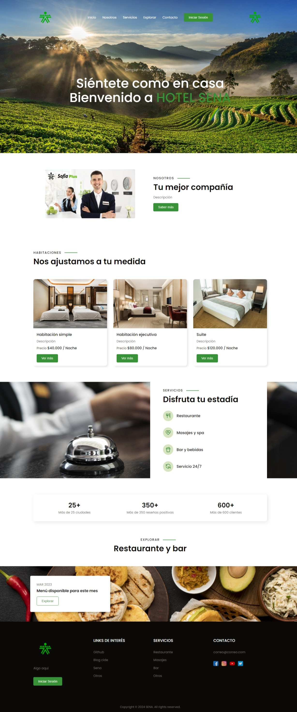

BUGS

- El panel de administrador ya está completo, todo es responsivo aunque la tabla de usuarios es muy ancha y se desborda.

- Hay dos logos en el index, el del costado derecho será para TechStay.

- El logo del panel debe ser reemplazado por el TechStay.

- El logo del panel no se ve en la vista de editar tipo servicio ni en editar consumo.

- No hay footer en el panel, se aceptan sugerencias.

<---  BORRAR TEXTO AL SOLUCIONAR PARA DEJAR EL README BIEN MELO  --->

